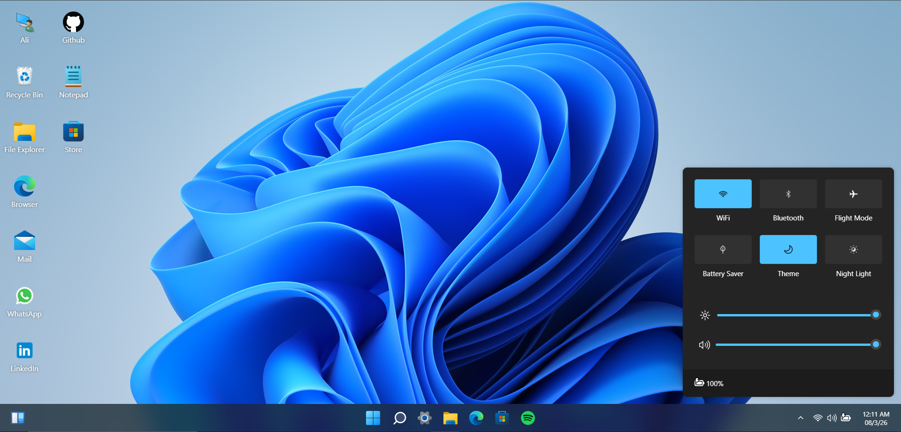
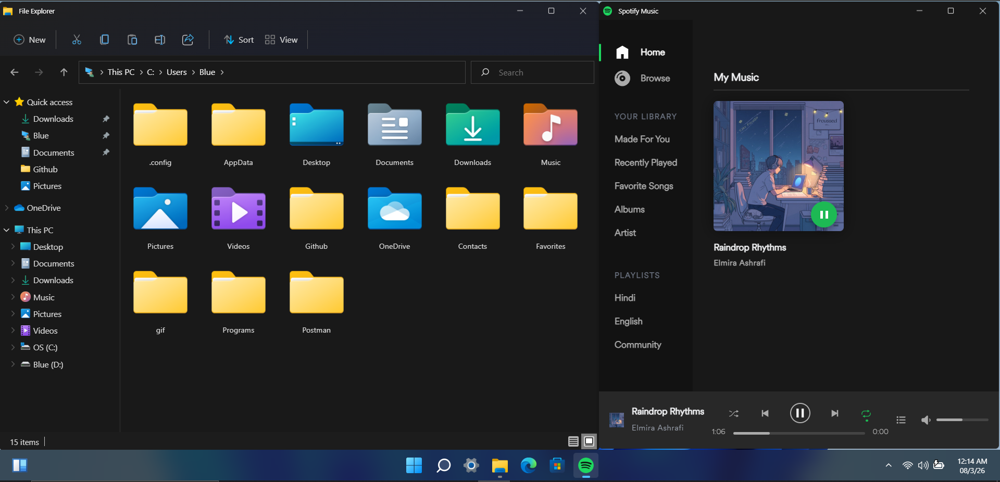
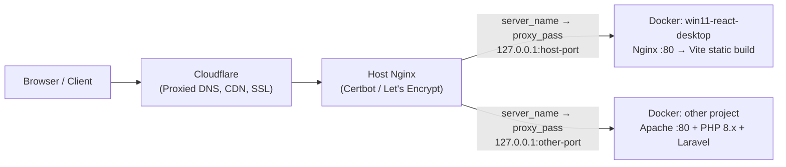
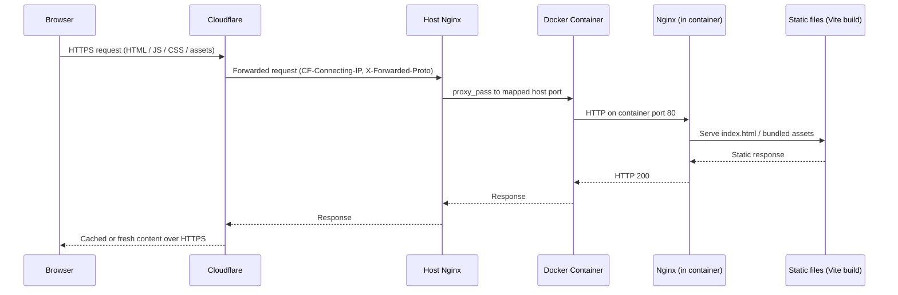

# Win11 React Desktop

[](https://win11-react-desktop.ashrafisolutions.com/)

**Live site:** https://win11-react-desktop.ashrafisolutions.com/





## Production Infrastructure

Win11 React Desktop is served in production at [https://win11-react-desktop.ashrafisolutions.com/](https://win11-react-desktop.ashrafisolutions.com/) as a static single-page application. Traffic reaches a Docker container that serves the Vite build output — no Apache or PHP runtime is involved for this project. The same origin server hosts other applications in separate containers, some of which do run Apache with PHP for Laravel workloads.

| Layer | Component | Role for this project |
|-------|-----------|------------------------|
| **Edge** | Cloudflare | Proxied DNS (orange cloud), CDN caching, DDoS protection, SSL termination at the edge |
| **Origin** | Host Nginx | Domain routing by `server_name`, reverse proxy to the container's mapped host port, Let's Encrypt certificates via Certbot |
| **Runtime** | Docker container | Nginx on port 80 serving the Vite `build/` output (React 18 static SPA) |

**Deployment summary**

| Item | Value |
|------|-------|
| Live site | [https://win11-react-desktop.ashrafisolutions.com/](https://win11-react-desktop.ashrafisolutions.com/) |
| Container host port | Dedicated mapped port on the host (routed by Nginx `server_name`) |
| Runtime in container | Nginx :80 serving static assets from Vite production build |
| Framework / stack | React 18 + Vite 3 (static SPA, PWA-capable) |
| Webhooks / external callbacks | None |

### Architecture overview



### Request flow



**Cloudflare** sits in front of every public domain with proxied DNS (orange cloud enabled). It provides CDN edge caching for static assets, DDoS mitigation, and TLS at the perimeter. Origin requests carry `CF-Connecting-IP` for the real client address and `X-Forwarded-Proto` so the host knows the original scheme was HTTPS. Cloudflare SSL mode is set to **Full (Strict)** so traffic between Cloudflare and the origin remains encrypted end-to-end.

**Host Nginx** runs directly on the server operating system — it is not inside Docker. Each domain has its own `server_name` block that forwards traffic to the correct container via `proxy_pass` on a dedicated `127.0.0.1` host port. TLS certificates are issued and renewed on the host with **Let's Encrypt** and **Certbot**, keeping certificate management separate from individual containers.

**Docker and runtime for this app** package only the production build of the React application. After `npm run build`, the `build/` directory is served by **Nginx on port 80** inside the container — there is no Apache, PHP, or application server process. This differs from PHP/Laravel projects on the same host, where containers typically run Apache on port 80 with PHP-FPM. Win11 React Desktop is a purely client-side SPA; all routing after the initial page load is handled by React in the browser.

An interactive **Windows 11 desktop simulator** built with React — designed as a creative portfolio experience that showcases modern frontend engineering, UI craftsmanship, and state-driven application architecture.

> **Disclaimer:** This project is not affiliated with Microsoft and is not a real operating system or Windows 365 cloud PC. It is a browser-based UI simulation built for educational and portfolio purposes.

## Project Overview

Win11 React Desktop recreates the look and feel of a Windows 11 workstation entirely in the browser. Users can explore a boot screen, lock screen, start menu, taskbar, widgets, and a suite of desktop applications — all rendered with React components and managed through a centralized Redux store.

The project demonstrates how complex desktop-like interactions (window dragging, snapping, resizing, z-index management, and multi-app state) can be implemented without a traditional UI component library, using custom SCSS, Tailwind CSS utilities, and hand-crafted components.

## Main Features

- **Desktop shell** — Boot screen, lock screen, wallpaper themes, and brightness controls
- **Start menu & search** — Pinned apps, recommended items, and power controls
- **Taskbar** — Running apps, system tray, clock, and quick settings
- **Window management** — Drag, resize, maximize, minimize, and snap layouts
- **Built-in applications**
  - File Explorer with virtual file system
  - Microsoft Edge-style browser with bookmarked portfolio links
  - Terminal with interactive commands (`help`, `about`, `systeminfo`, `dir`, etc.)
  - Notepad, Calculator, Camera, Settings, Task Manager
  - Microsoft Store with featured project cards
  - Spotify-style music player, Whiteboard, Discord embed, and more
- **Widgets & side pane** — Calendar, news feed, and quick-glance panels
- **Internationalization** — Multi-language support via i18next
- **Progressive Web App** — Installable with offline-ready service worker (Vite PWA plugin)
- **Desktop packaging** — Optional Tauri wrapper for native desktop builds

## Technologies and Frameworks

| Layer | Technology |
|-------|-----------|
| UI Framework | React 18 |
| State Management | Redux |
| Build Tool | Vite 3 |
| Styling | SCSS, CSS Modules, Tailwind CSS |
| Icons | Font Awesome |
| i18n | i18next, react-i18next |
| HTTP Client | Axios |
| Auth (optional) | Firebase Auth (GitHub OAuth) |
| Desktop Wrapper | Tauri 1.x |
| PWA | vite-plugin-pwa |
| Error Tracking | Sentry (optional) |

## Architecture and Project Structure

```
win11-react-desktop/
├── public/                  # Static assets, locales, manifest, wallpapers
├── src/
│   ├── actions/             # Redux action creators
│   ├── components/          # Shell UI (taskbar, start menu, menu, login)
│   ├── containers/
│   │   ├── applications/    # Desktop apps (explorer, terminal, edge, etc.)
│   │   └── background/      # Boot, lock, and wallpaper screens
│   ├── reducers/            # Redux reducers (apps, desktop, taskbar, files, etc.)
│   ├── utils/               # App registry, helpers, shared UI primitives
│   ├── App.jsx              # Root layout and error boundary
│   ├── index.jsx            # React entry point
│   └── i18nextConf.js       # Internationalization setup
├── src-tauri/               # Tauri native desktop configuration
├── index.html               # HTML entry point
├── vite.config.js           # Vite and PWA configuration
├── tailwind.config.js       # Tailwind CSS configuration
└── package.json
```

### State Management

The application uses a single Redux store composed of domain-specific reducers:

- `apps` — Open windows, z-order, dimensions, and visibility
- `desktop` — Desktop icons and context menu state
- `taskbar` — Pinned and running applications
- `startmenu` / `sidepane` / `widpane` — Shell panel visibility
- `wallpaper` — Theme, boot/lock state, brightness
- `files` — Virtual file system for Explorer
- `setting` — System settings and user profile
- `globals` — Cross-cutting UI state

### Application Registry

Desktop applications are registered in `src/utils/apps.js` and dynamically loaded through `src/containers/applications/`. Each app is a self-contained React component with its own Redux slice entry, toolbar, and window chrome.

## Installation and Setup

### Prerequisites

- **Node.js** 16+ (18+ recommended)
- **npm** 8+

### Steps

```bash
# Clone the repository
git clone https://github.com/elmira-ashrafi/win11-react-desktop.git
cd win11-react-desktop

# Install dependencies
npm install

# Start the development server
npm start
```

The app will be available at `http://localhost:5173` (Vite default port).

### Environment Variables

Create a `.env` file in the project root if needed:

```env
PUBLIC_URL=.
```

> **Note:** `.env` files are excluded from version control. Do not commit secrets or API keys.

## Usage Instructions

| Command | Description |
|---------|-------------|
| `npm start` | Start Vite dev server with hot reload |
| `npm run build` | Create production build in `build/` |
| `npm run preview` | Preview the production build locally |
| `npm run ghbuild` | Production build with `CI=false` (for GitHub Pages) |
| `npm run prettier` | Format code with Prettier |
| `npm run tauri` | Run Tauri desktop commands |

### Exploring the Desktop

1. Wait for the boot animation to complete
2. Unlock the desktop from the lock screen
3. Click the **Start** button or press the Windows key area to open the start menu
4. Launch apps from the desktop, start menu, or taskbar
5. Right-click the desktop for context actions
6. Open **Terminal** and type `help` to see available commands
7. Open **Notepad** for a quick portfolio summary

## API Overview

This is a client-side application with no custom backend. External integrations include:

| Integration | Purpose | Endpoint / Config |
|-------------|---------|-------------------|
| Firebase Auth | Optional GitHub login | Configured in `src/components/login.js` |
| JioSaavn Proxy | Music search (Spotify app) | `https://dev.saavn.me` |
| IP Geolocation | Terminal `ipconfig` command | `https://ipapi.co/json` |
| Sentry | Error monitoring (optional) | Configured via Sentry SDK |

All third-party API keys should be managed through environment variables in production deployments.

## Testing

This project does not currently include an automated test suite. Manual testing is recommended:

1. Run `npm start` and verify the boot → lock → desktop flow
2. Open and interact with each built-in application
3. Test window drag, resize, snap, minimize, and close
4. Run `npm run build` and `npm run preview` to verify production builds
5. Test PWA installation in Chrome/Edge (Application → Manifest)

## Deployment Notes

### Static Hosting (GitHub Pages, Netlify, Vercel)

```bash
npm run ghbuild
```

Deploy the contents of the `build/` directory. Set the base path in `vite.config.js` if hosting under a subpath.

### Heroku / Railway

A `Procfile` is included for process-based hosting. Set the `PORT` environment variable as required by the platform.

### Tauri Desktop Build

```bash
npm run tauri build
```

Requires Rust toolchain and platform-specific Tauri dependencies. See [Tauri documentation](https://tauri.app/) for setup.

### Firefox Note

Backdrop blur effects require enabling `layout.css.backdrop-filter.enabled` in `about:config`.

## Acknowledgments

This project is based on [win11React](https://github.com/blueedgetechno/win11React) by [blueedgetechno](https://github.com/blueedgetechno), originally released under CC0-1.0. It has been customized and extended as a personal portfolio showcase.

## License

This project is licensed under the [MIT License](./LICENSE).

## Author

**Elmira Ashrafi**

- GitHub: [@elmira-ashrafi](https://github.com/elmira-ashrafi)
- Email: [elmiraashrafiiii@gmail.com](mailto:elmiraashrafiiii@gmail.com)
